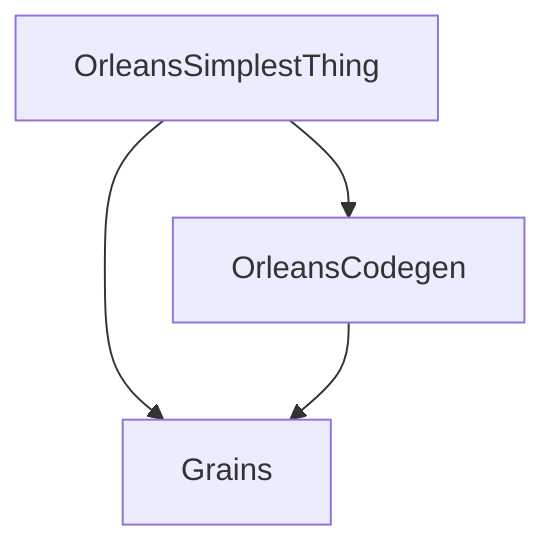

# OrleansSimplestThing

This repository demonstrates a minimal implementation of [Microsoft Orleans](https://github.com/dotnet/orleans) using F#. It serves as a simple example showcasing how to use Orleans with F# and specifically focuses on solving serialization challenges.

## Overview

This project is an attempt to get the serialization of F# Discriminated Unions working with Orleans using JSON serialization. Currently, the implementation demonstrates the structure and approach, but there are still challenges with the serialization of Discriminated Unions.

The project structure is modeled after and borrows fixes from the [OrleansFsharp CodeGen example](https://github.com/DejanMilicic/OrleansFsharp), which demonstrates effective patterns for using F# with Orleans.

## Project Structure

The solution consists of three projects:

1. **Grains** - Contains Orleans grain implementations written in F#
2. **OrleansCodegen** - Handles the code generation for Orleans serialization
3. **OrleansSimplestThing** - The main application, combining Orleans and ASP.NET Core



### Grains

The `Grains` project contains the definition of the grain interfaces and implementations. It includes:

- `SimpleGrain.fs` - Implements a basic grain with simple mathematic operations and demonstrates an attempt at using Discriminated Unions in Orleans.

### OrleansCodegen

The `OrleansCodegen` project is responsible for handling Orleans' code generation, particularly for F# types:

- `CodeGen.cs` - Configures Orleans code generation by pointing to the grain definitions.

### OrleansSimplestThing

The main web application that hosts the Orleans silo and provides an HTTP API to interact with the grains:

- Contains controllers for accessing grain functionality
- Configures Orleans with JSON serialization in an attempt to handle F# Discriminated Unions

## Serialization Challenges

The primary goal of this project is to demonstrate how to serialize F# Discriminated Unions with Orleans using JSON serialization. The current implementation includes:

1. Custom serialization configuration in `Program.fs`
2. Proper tagging of Discriminated Union types
3. Code generation setup in the `OrleansCodegen` project

However, there are still challenges with serialization of F# Discriminated Unions that this repository aims to address.

## Building and Running

The project targets .NET 10.0 and uses the latest Orleans packages.

To build and run the project:

```
dotnet build
dotnet run --project OrleansSimplestThing
```

## API Endpoints

The application exposes several endpoints:

- `POST /math/add` - Add a number to the grain's state
- `POST /math/subtract` - Subtract a number from the grain's state
- `POST /math/useDiscriminatedUnion` - Attempt to use a Discriminated Union type with Orleans

## Further Resources

- [Microsoft Orleans Documentation](https://docs.microsoft.com/en-us/dotnet/orleans/)
- [F# Documentation](https://docs.microsoft.com/en-us/dotnet/fsharp/)
- [OrleansFsharp Repository](https://github.com/DejanMilicic/OrleansFsharp)